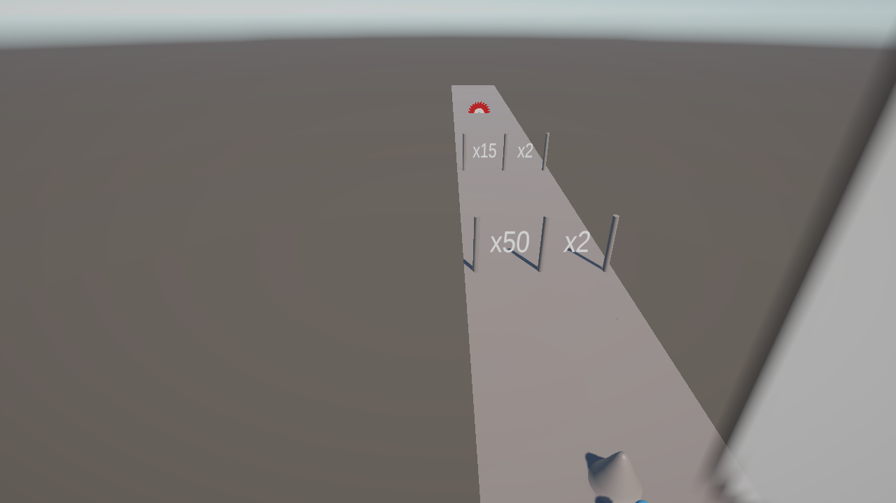
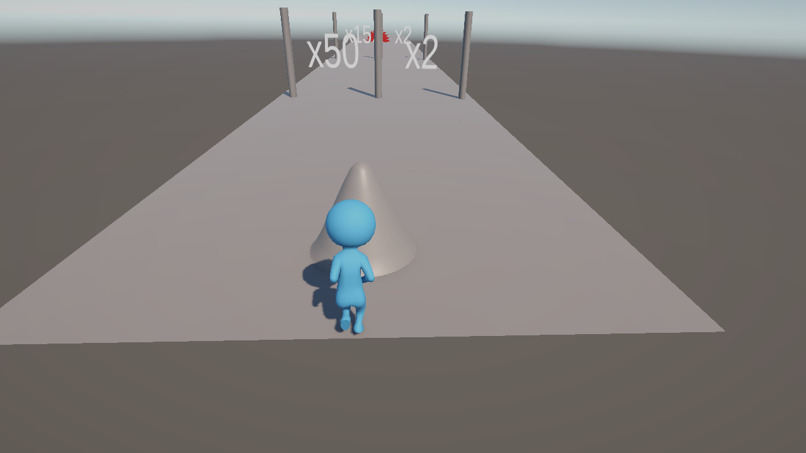

# Spiral Squad: Math Run 🌀

> Up to **200 soldiers follow you in a perfect sunflower spiral** while you steer them through
> `+N` / `×N` math gates, fight hive-mind enemies, and dodge spinning saws.

A high-performance 3D **crowd-runner** built for mobile. The gimmick is the formation: your squad
tracks around you in a **Fermat spiral** (golden angle 137.5°) — the same phyllotaxis pattern as a
sunflower — so a massive crowd arranges itself naturally, never overlapping, never colliding.

**Play the demo:** [vuivd.itch.io/spiral](https://vuivd.itch.io/spiral)




<!-- Drop a short gameplay GIF here for maximum impact:

-->

---

## Features

- 🌀 **Fermat-spiral crowd formation** — up to 200 logical runners with a `spacing·√i, angle·i·137.5°` layout
- 🚪 **Math gates** — `+N` and `×N` gates, plus left/right **choice doors**
- ⚔️ **Hive-mind enemies** — spotting one alerts the whole group; each enemy picks off a squad member
- 🪚 **Kinetic hazards** — sweeping circular saws, spikes, and runners falling off the track edge
- 🎮 **Tight controls** — drag / A·D / arrow keys to steer, Space to jump (coyote time + input buffering)
- 📱 **Mobile-focused performance** — object pooling, NonAlloc physics queries, logical→visual crowd compression

## Hard problems I solved

1. **Crowd compression (200 logical → ≤100 visual).**
   `×N` gates can explode the logical count past 1000. Instead of spawning 1000 GameObjects, the
   crowd renders at most `maxVisualClones` and uses an inverse-lerp between
   `oneToOneLimit` and `compressionEndLogicalCount` to decide the visual count, while each visual
   runner "represents" a share of the logical count (`GetDesiredVisualRunnerCount`,
   `GetLogicalLossForVisualRunner`). This is what keeps a full army at 60 FPS on low-end devices.

2. **Allocation-free Fermat-spiral formation.**
   Every frame each runner is placed at `distance = spacing·√i`, `angle = i·137.5°` from the lead —
   a uniform, non-overlapping layout that needs **zero per-runner collision checks**. Only the lead
   runner is clamped to the track; clones naturally fall off when the crowd outgrows the road.

3. **Deterministic, allocation-free edge-falling.**
   A clone is only tested once it's outside the track boundary (+margin), using a pooled
   **NonAlloc** raycast, a **3-frame confirmation**, and a **0.5 s spawn grace period** — so a big
   crowd sheds runners at the edges organically, without per-frame allocation spikes.

4. **No `Instantiate`/`Destroy` during gameplay.**
   All clones live in a pre-warmed object pool. Gate conversions, combat losses, and edge-falls
   activate/deactivate pooled objects instead of allocating at runtime.

5. **NonAlloc everywhere it matters.**
   `Physics.OverlapSphereNonAlloc` / `RaycastNonAlloc` with cached result arrays in the hot loops
   (`PlayerCrowdManager`, `CircularSaw`), plus `CompareTag` fast-path obstacle filtering instead of
   allocating string comparisons.

## Architecture

| Script | Responsibility |
|---|---|
| `PlayerController.cs` | `CharacterController` movement; drag/keyboard steering; jump with coyote time + input buffer |
| `PlayerCrowdManager.cs` | Clone pool, Fermat-spiral formation, logical↔visual crowd compression, edge-falling, combat resolution, game-over checks |
| `Gate.cs` / `Door.cs` | `+N` / `×N` crowd math; `Door` lets the player pick left vs right bonus |
| `Enemy.cs` | Detection radius, group hive-mind alert, chase + one-vs-one kill |
| `EnemySpawner.cs` / `GroupSpawner.cs` | Fermat-spiral enemy clusters |
| `CircularSaw.cs` | PingPong-sweeping hazard with a distance-based kill check |
| `UIManager.cs` | Menu / HUD / game-over / you-win flow + Cinemachine slow-mo lead-fall camera |

## Tech stack

- **Unity 6000.3.16f1** · URP 17.3.0
- **Cinemachine 3.1.6** (lead-fall slow-mo camera)
- **Input System 1.19.0** · **TextMeshPro** · **ProBuilder**

## Getting started

```bash
git clone <this-repo-url>
# Open with Unity 6000.3.16f1, then open:
#   Assets/Scenes/SampleScene.unity
# and press Play.
```

**Controls:** click/tap to start · drag (mouse/touch) or `A`/`D`/`←`/`→` to steer · `Space` to jump

## Status

Core systems complete. In progress: polish, audio, additional levels, and a publish-ready WebGL
build (see `.github/workflows/` for CI).
